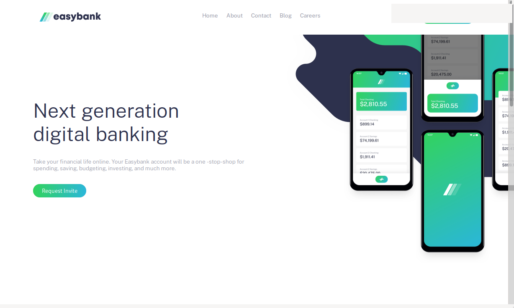

# Frontend Mentor - Easybank landing page solution

This is a solution to the:  
[Easybank landing page challenge on Frontend Mentor](https://www.frontendmentor.io/challenges/easybank-landing-page-WaUhkoDN). 

### Screenshot

  

- Live Site URL: https://ahmed-wally.github.io/easybank-landing-page 

## My process

### Built with

- CSS custom properties
- Flexbox
- [React](https://reactjs.org/) - JS library

### What I learned

my purpose of doing this challenge was to get familiar with React after I learned it, so it was enough for me to make desktop only.
it was hard to deal with css and I think that using Tailwind will make things very easy. 

